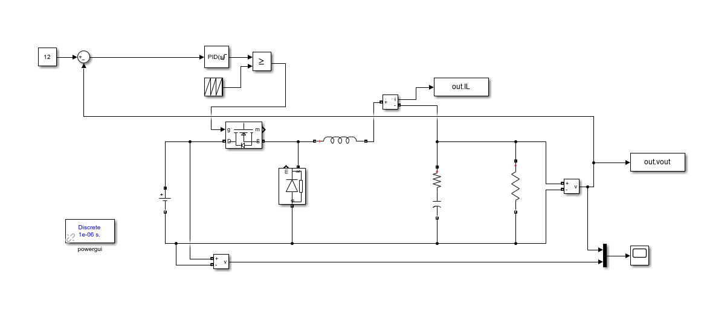
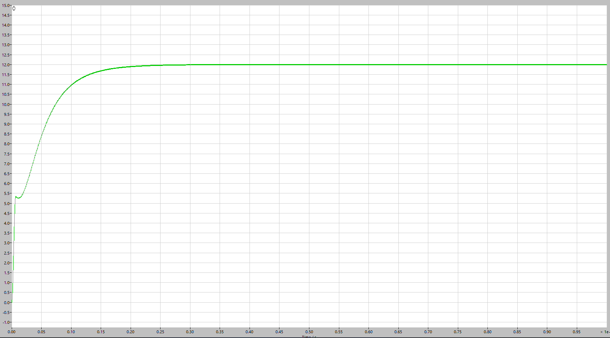
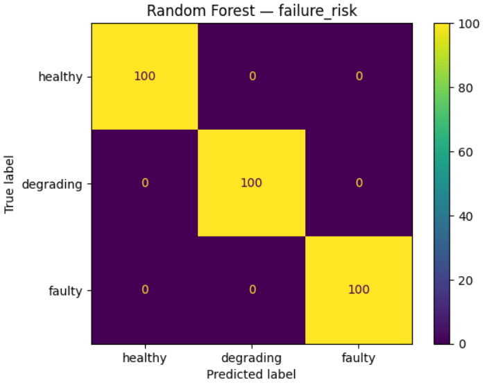
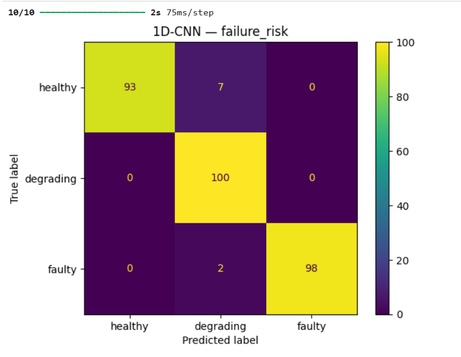

ML-DRIVEN HARDWARE-IN-LOOP BUCK CONVERTER WITH ESP32

This is a Machine Learning Driven Hardware-in-Loop project that uses ESP32 as a control of the buck converter and for predictive maintenance.

Project Overview
Capacitor aging is one of the leading causes of DC-DC converter degradation and failure. The problems arising from capacitor degradation are increased output voltage ripples which lead to increased voltage spikes during switching, increased power loss which in turn reduces efficiency and also increased thermal effects. This project demonstrates a real-time Controller Hardware-in-the-Loop (C-HIL) platform for a DC-DC buck converter using an ESP32 as the physical controller and MATLAB/Simulink as the simulated power stage.

The system consists of:

Closed loop PI control for voltage regulation.
Real time UART communication between Simulink and ESP32.
Embedded TinyML fault classification(3 classes: HEALTHY/DEGRADING/FAULTY) using TensorFlow Lite Micro.
Predictive Maintenance based on results for Machine Learning for capacitor ESR degradation.

The objective of the project is to bridge the gap between simulation and real embedded power electronics control.

Key Features

a)Real-Time Control
The ESP32 receives output voltage(vout), from the converter in Simulink using the UART serial communication protocol, and calculates the control action using a PI Controller and transmits the updated duty cycle back to the converter to drive the MOSFET.

b)Hardware-in-Loop Architecture
Plant(converter model):MATLAB/Simulink
Controller: ESP32 devkit
Communication Protocol: UART @ 115200 baudrate

c)Embedded Machine Learning
A quantized TensorFlow Lite model runs on ESP32 and does classification of capacitor health of the series RLC branch of the converter into either HEALTHY, DEGRADING or FAULTY. The classification is derived from the output voltage and current waveforms samples during operation.

2. System Architecture

Simulink Buck Converter Model(PC)
        |
        | vout
        v
      UART
        |
        v
      ESP32
  -----------------
  PI Controller: Core 1
  TinyML Inference: Core 0
  -----------------
        |
        | Duty Cycle
        v
      UART
        |
        v
Simulink Plant Update

i)Control Strategy
ESP32 receives vout from the converter in Simulink via the UART communication protocol and using the PI controller calculates the duty cycle and regulates vout to a reference voltage of 12V.
 
    error = vref - vout
    integral += error * Ts
    duty cycle = Kp * error + Ki * integral
Duty cycle is confined between 0 and 1
## Simulink Model

ii)Machine Learning Strategy
The TinyML using the TFLite tool runs on the ESP32 and monitors the converter, taking readings of output voltage every 500ms and predicts the capacitor health and does classification. The model is quantized into INT8 for efficient execution on the ESP32.

iii)Software Stack
PC side: MATLAB/Simulink
ESP32 side: Arduino Framework, freeRTOS dual-core operation, TFLite for Microcontrollers, UART Communication

iv)freeRTOS Task Structure
Core 1: Higher Priority, PI Control
	Receives vout via UART
	Computes duty cycle
	Transmits duty cycle back to converter
Core 0: Lower Priority, ML Task
	Collect waveform window
	Run TinyML inference
	Update health state

3.Project Structure
ml-hil-esp32/
├── simulink/     — Simscape buck converter model
├── data/         — [Kaggle Dataset](https://www.kaggle.com/datasets/otienohumphrey254/buck-converter-capacitor-esr-fault-detection-data/data)
├── ml/           — Training notebooks, TFLite conversion
├── src/          — main.cpp, model.h
├── images/
└── README.md

4. Results
a) Vout Regulated to 12V 
b) Random Forest Classification: 100% accuracy, 3-class 
c) 1D-CNN: 97% accuracy, 3-class 

5. Industrial Relevance
This project reflects industrial engineering workflows. Capacitor degradation has been a major source of converter and power systems failure. The project implements a Hardware-in-Loop deterministic real-time control alongside ML and on the device inference without cloud dependency. It can be used in the following industries:
Power electronics control and validation
Automotive converter control
Battery Control
Embedded diagnostics
Predictive Maintenance Systems

6. Future Improvements
Implement CAN/SPI communication instead of UART
Web dashboard monitoring
Remaining Useful Life (RUL) prediction

7.Author
Humphrey Otieno Ochieng
Msc. Microelectronics and Microsystems Engineering
Technische Universität Hamburg Harburg(TUHH)